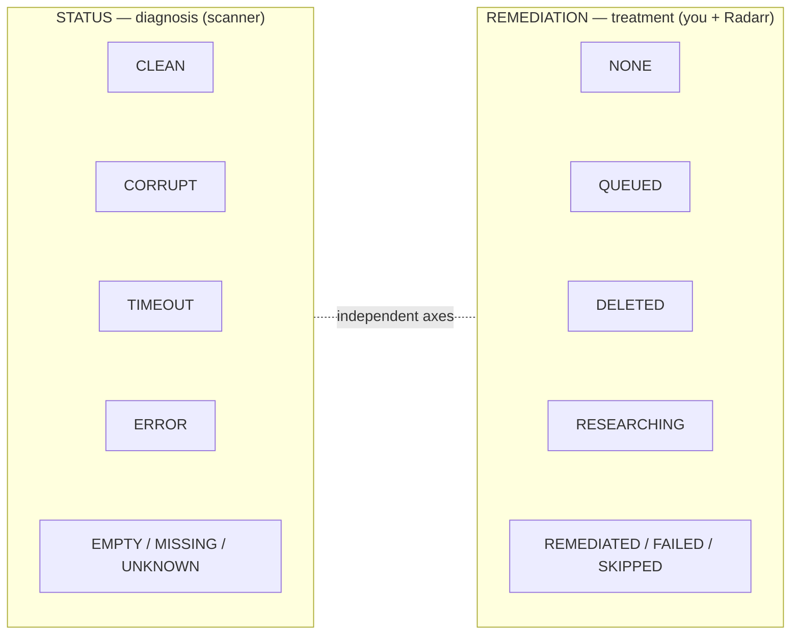
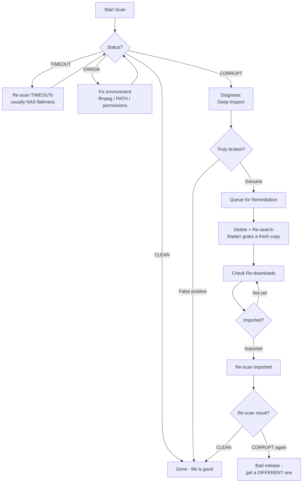
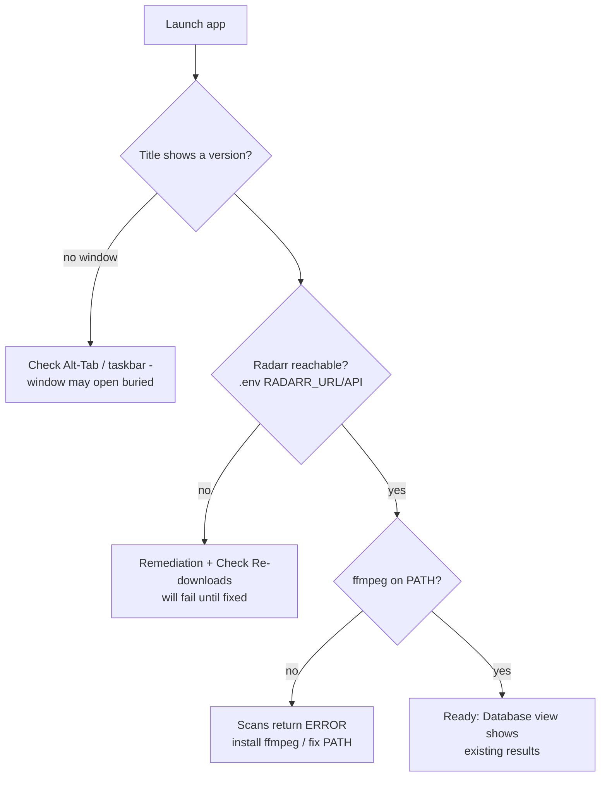
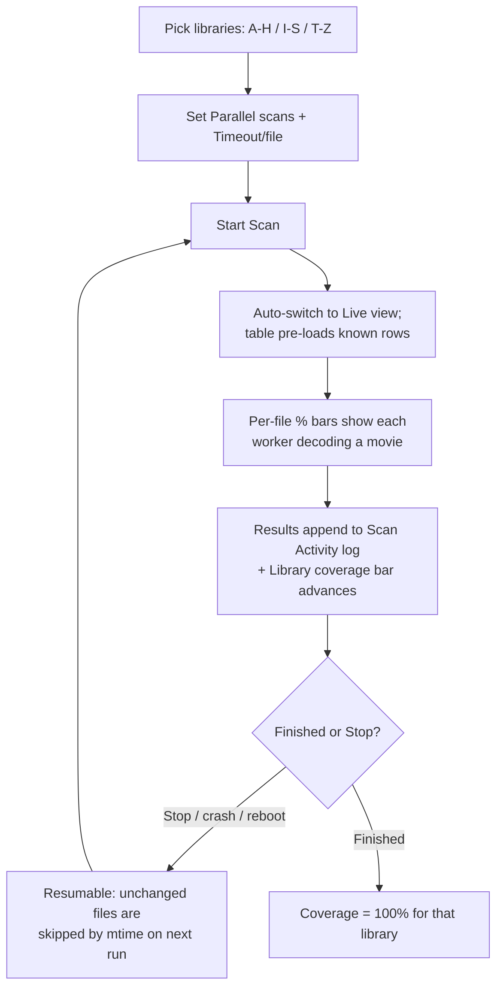
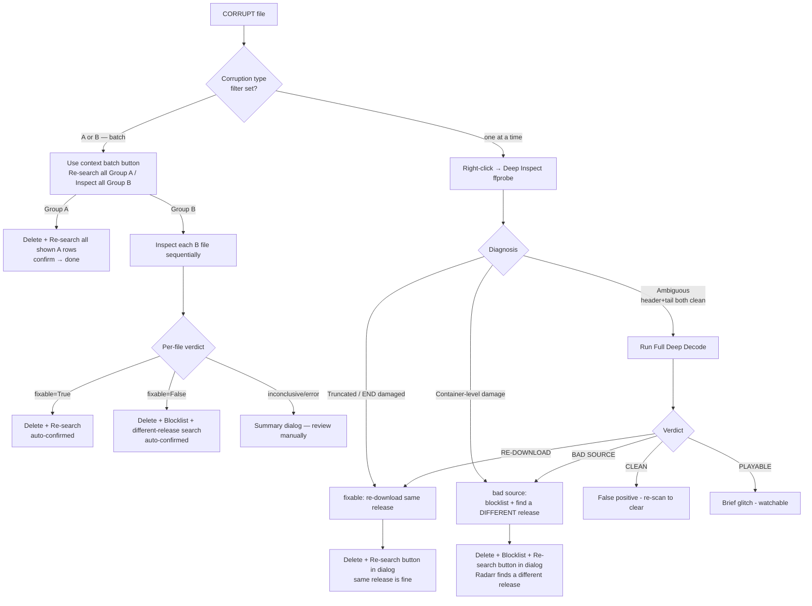
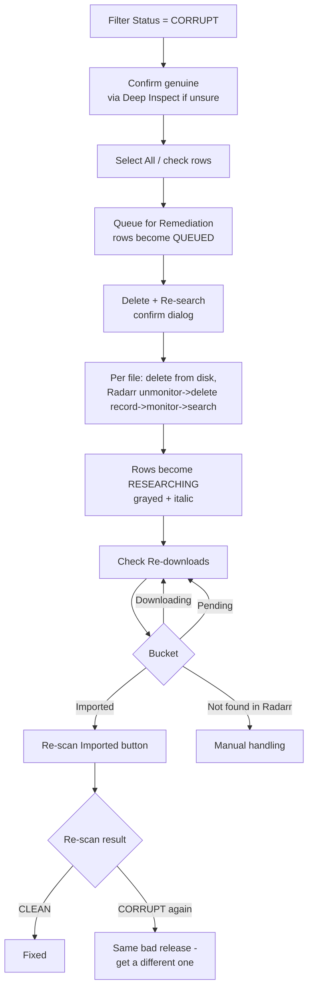
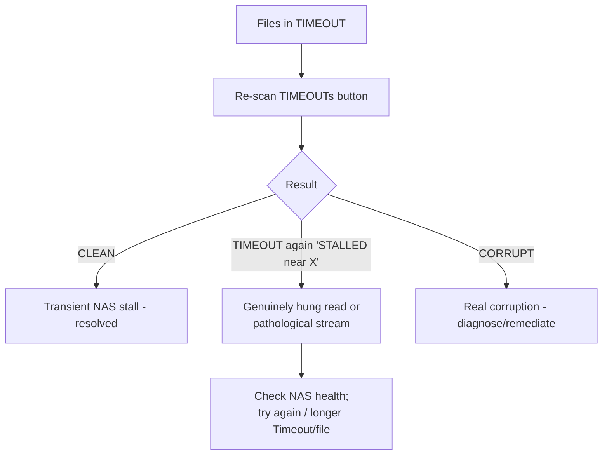
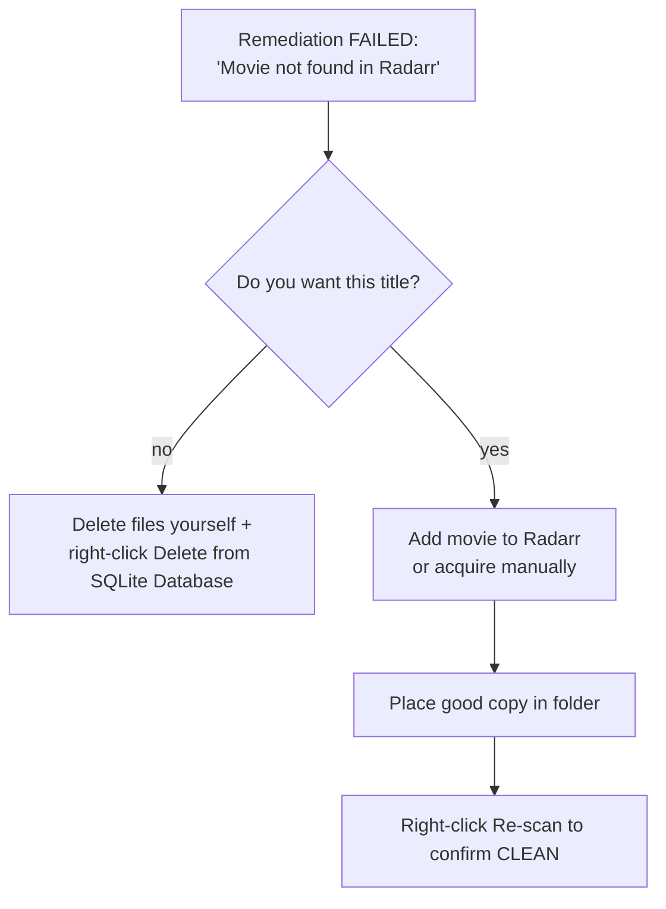
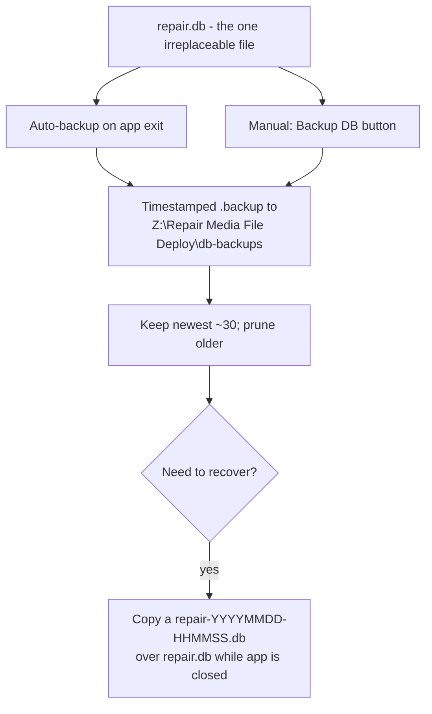

# Repair Broken Media Files — User Manual

A task-oriented guide to using the app: how it thinks, the common paths through it,
and step-by-step scenarios with flow diagrams.

- New to the window? Read [INTERFACE.md](INTERFACE.md) for a tour of every control.
- Want quick task recipes? See [WORKFLOW.md](WORKFLOW.md).
- This manual ties it all together: **when** to do **what**, and **why**.

> Diagrams below use Mermaid, which GitHub renders automatically.

---

## 1. What the app does (mental model)

The app scans your movie library, **fully decodes each video with ffmpeg** to find
files that are structurally broken (corruption a quick header check would miss),
and helps you **replace** the bad ones via Radarr.

The single most important idea is that every movie has **two independent states**:

| Column | Question it answers | Who sets it |
|--------|--------------------|-------------|
| **Status** | *Is this file OK?* (the diagnosis) | the scanner |
| **Remediation** | *What have I done about it?* (the treatment) | you + Radarr |

They move independently. A file can be `CORRUPT` (Status) and `RESEARCHING`
(Remediation) at the same time.

---

## 2. The big picture: the core loop

Most of your time is one loop: **scan → diagnose → remediate → re-download → verify.**

The rest of this manual walks each branch as its own scenario.

---

## 3. First run / setup

Key facts:
- The app is launched from the **Movie Tools Launcher** folder. Its exe reads the
  **canonical `repair.db`** in the source project folder (via `REPAIR_DB_PATH` in the
  launcher's `.env`) — one database, shared by the exe and any source run.
- **ffmpeg/ffprobe must be on PATH** or scans/inspections fail.
- The window title shows the running **version** (also `RepairBrokenMedia.exe version`).
  If the title version is old, you're running stale code.

---

## 4. Scenario: full library scan (first time & resuming)

Notes:
- A full decode of every file over a NAS is a **multi-day** job for a large library.
  The **Library coverage bar** (scoped to the selected libraries) is your progress
  indicator; the session bar below it is just the current run.
- **Resuming is safe.** Files with a definitive verdict whose size+mtime are unchanged
  are skipped, so a resumed scan re-decodes nothing already done.
- **Stopping is safe.** An in-flight file that's interrupted is reset to UNKNOWN
  (never falsely recorded as CORRUPT).

---

## 5. Scenario: a CORRUPT file — is it truly broken?

Don't delete on the CORRUPT flag alone. Diagnose first.

- **Deep Inspect** is fast (ffprobe + header + tail decode only). The report dialog
  offers a one-click action for both outcomes: **Delete + Re-search** (fixable) or
  **Delete + Blocklist + Re-search** (bad source — Radarr won't grab the same bad
  release again).
- **Inspect all Group B** (batch): inspects every visible Group B file sequentially
  and acts on definitive results automatically — no manual dialog for fixable/bad-source.
  Only inconclusive results need your attention.
- **Full Deep Decode** is opt-in and decodes the whole file (minutes), offered only
  when Deep Inspect is inconclusive. It maps where errors occur and returns a verdict.
- Benign `-f null` muxer "non monotonic DTS" warnings are **ignored** by both the
  scanner and the full decode — they are not corruption.

---

## 6. Scenario: remediate & verify (the full replace loop)

Critical point: **"Imported" is not "verified."** Radarr importing a file only means
a file *arrived and matched metadata/quality* — Radarr never decodes it. The
**Re-scan Imported** step is the real health check that flips CORRUPT → CLEAN (or
catches a re-grab that's still broken).

---

## 7. Scenario: TIMEOUTs

TIMEOUT is **not** a verdict — it means the decode didn't finish in the budget,
usually transient NAS I/O slowness. Most clear to CLEAN on a re-scan. The timeout is
duration-aware (long low-bitrate films get a fair budget), and a **stall detector**
flags a read that makes no progress for ~5 minutes as "STALLED near X".

---

## 8. Scenario: "Not found in Radarr" (manual handling)

Some titles aren't managed by Radarr (or share a TMDB entry, e.g. a director's/final
cut that isn't its own movie). Remediation then FAILS with "Movie not found in Radarr".

Radarr manages **one file per movie (one TMDB id)**. It won't hold "theatrical + final
cut" as two tracked files; editions are just a naming label on the one file.

---

## 9. Scenario: backups & recovery

The database holds all scan results, remediation state, the activity log, and the
mtime fingerprints that keep resumed scans fast. Losing it means re-scanning the whole
library. Backups are consistent SQLite `.backup` snapshots to the Z: deploy share.

---

## 10. Decision guide: which statuses should I re-scan?

Re-scanning only changes the outcome for states that were never a real verdict.

| Status | Re-scan? | Why |
|--------|----------|-----|
| **TIMEOUT** | **Yes** (button) | Environmental (slow/hung NAS), not a verdict |
| **UNKNOWN** | **Yes** | Interrupted / never decided |
| **ERROR** | **Yes, after fixing the cause** | Infrastructure failure, not the file |
| CORRUPT | No — **Deep Inspect** instead | Deterministic on the same bytes |
| CLEAN | No | Definitive pass |
| EMPTY | Only if you added a video | No video was present |
| MISSING | Use "Verify Folder Exists" | Folder-existence check |

The **Problematic** status filter selects `TIMEOUT + UNKNOWN + ERROR` in one click.

---

## 11. Reference (quick)

**Statuses:** CLEAN · CORRUPT · TIMEOUT · ERROR · EMPTY · MISSING · SCANNING · UNKNOWN
**Remediation:** NONE · QUEUED · DELETED · RESEARCHING · REMEDIATED · FAILED · SKIPPED
(rows in DELETED/RESEARCHING/REMEDIATED are grayed + italic)

**Bottom buttons:** Select All · Select None · Re-scan TIMEOUTs · Backup DB ·
Check Re-downloads · Queue for Remediation · Delete + Re-search ·
Re-search all Group A / Inspect all Group B (context batch — enabled by Corruption type filter) ·
Open Folder · Show ffmpeg Log

**Right-click:** Open Folder · Show ffmpeg Log · Deep Inspect (ffprobe) · Re-scan ·
Queue/Remove from Queue · Mark as Skipped · Verify Folder Exists ·
Delete from SQLite Database · Copy Path

**CLI** (`RepairBrokenMedia.exe <cmd>` or `python main.py <cmd>`):
- `scan [--workers N] [--root PATH ...] [--rescan] [--limit N] [--timeout SEC]`
- `rescan-corrupt [--states CORRUPT,TIMEOUT,...] [--workers N] [--timeout SEC] [--limit N] [--dry-run]`
- `list [--corrupt|--clean|--error|--empty|--queued] [--sort size_bytes|folder_path|last_scan_at]`
- `queue [--all-corrupt | <folder name>...]`
- `remediate [--dry-run] [--max N]`
- `benchmark [...]`
- `version`

A CLI scan **refuses to run** while the GUI (or another scanner) holds the lock, and
vice-versa — this prevents two writers corrupting/hanging the SQLite DB.

See [INTERFACE.md](INTERFACE.md) for the full control-by-control reference.

---

## 12. Troubleshooting

| Symptom | Likely cause | Fix |
|---------|--------------|-----|
| App "didn't launch" | Window opened **buried** in Alt-Tab | Alt-Tab / click taskbar icon |
| Table empty on startup | Wrong view mode or (old bug) exe used a temp DB | Set view to **Database**, Status = **All**; ensure v1.7.4+ |
| UI lags 4-5s per click | **NAS latency** blocking a UI-thread read | Transient; check Z: health; restart app if stale |
| Both progress bars stuck at 0% | ffmpeg **hung on a NAS read** (CPU flat) | Stall detector times it out (~5 min); or Stop + re-scan |
| Can't start a scan ("Scanner Busy") | Another scanner holds the **lock** | Close the other instance; stale locks auto-clear |
| Movie won't re-download | **Not in Radarr** (FAILED) | Add to Radarr or handle manually (Scenario 8) |
| "Imported" but still corrupt | Radarr re-grabbed the **same bad release** | Deep Inspect → if BAD SOURCE, use Delete + Blocklist + Re-search (or Inspect all Group B) so Radarr finds a different release |
| Lots of false TIMEOUTs | Long low-bitrate films / flaky NAS | Fixed by duration-aware timeout (v1.7.1+); re-scan |

---

*Part of the Media Tools Consortium. See also
[INTERFACE.md](INTERFACE.md), [WORKFLOW.md](WORKFLOW.md), and [USERGUIDE.md](USERGUIDE.md).*
